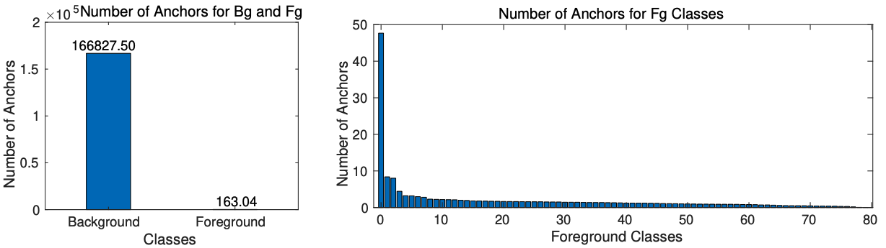

METU Dept. of Computer Engineering -- Graduate-level Course CENG7880 -- Trustworthy and Responsible AI

  <nav class="stroke">
    <ul>
      <li><a class="aS" href="#wid">About the Course</a></li>
      <li><a class="aS" href="#summary">Summary</a></li>
      <li><a class="aS" href="#publications">Publications</a></li>
      <li><a class="aS" href="#contact">Contact</a></li>
    </ul>
  </nav>

------

    
    <i>Figure 1: Many problems in practice exhibit strong imbalance towards certain classes or categories, which can severely impact learning performance. (a) Foreground-background imbalance problem in object detection. (b) Imbalance problem among object categories. (Figure source: [Oksuz et al., 2021](https://arxiv.org/abs/1909.00169)).</i>

-----
### <tag id="wid">What is DENGE?</tag>

DENGE is

### <tag id="summary">Summary</tag> 

Class imbalance 

### <tag id=publications>Publications</tag> 

The list of publicati

### <tag id=contact>Contact</tag> 

Please use the following email address for course related issues: metu-denge [@] googlegroups [dot] com
